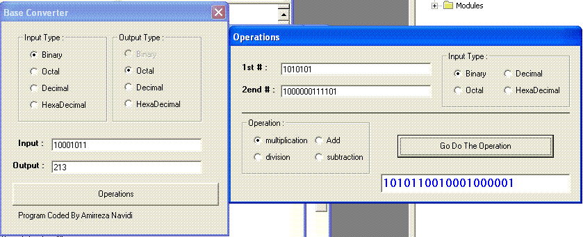



## Complete Base Convertion

### Description

This project Can Convert Numbers in any Base (Binary , Octal , Decimal , HexaDecimal) to another , and also You will be able to do Desired Operations including Division , Multiplication , Subtraction &amp; adding - simple interface will explain the usage
 
### More Info
 

             |
---                |---
**Submitted On**   |2005-08-02 19:22:54
**By**             |[Amirrez4 \(Amirreza Navidimajd\)](https://github.com/Planet-Source-Code/PSCIndex/blob/master/ByAuthor/amirrez4-amirreza-navidimajd.md)
**Level**          |Beginner
**User Rating**    |4.3 (13 globes from 3 users)
**Compatibility**  |VB 5\.0, VB 6\.0
**Category**       |[Math/ Dates](https://github.com/Planet-Source-Code/PSCIndex/blob/master/ByCategory/math-dates__1-37.md)
**World**          |[Visual Basic](https://github.com/Planet-Source-Code/PSCIndex/blob/master/ByWorld/visual-basic.md)
**Archive File**   |[Complete\_B192020822005\.zip](https://github.com/Planet-Source-Code/amirrez4-amirreza-navidimajd-complete-base-convertion__1-62044/archive/master.zip)

